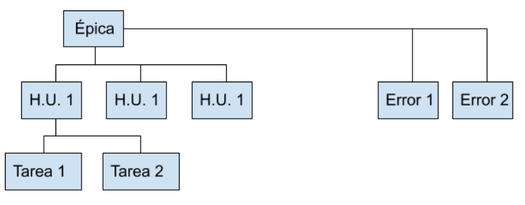

# 2) Herramientas Agile (Jira, Trello) e Introducción a Docker

00:00 Herramientas DevOps Xebialabs (ahora digital.ai): tabla periódica de herramientas devops. Se puede visualizar todos los tipos de herramientas que se pueden implementar dentro de una empresa para mejorar sus procesos.

[Tabla periodica de herramientas DevOps](https://digital.ai/periodic-table-of-devops-tools)

# Colaboración: JIRA

01:50 JIRA Software Try
JIRA Software Try (https://www.atlassian.com/es/try)
Plantillas: elegir una plantilla clasica para empezar.
Creando primer proyecto.

10:00 Interfaz
Permite implementar un backlog de producto, epicas, tareas, historias de usuario.

## 13:00 Crear incidencia (Historia de Usuario)
Quien llena la información de la historia debe se por lo general el Product Owner, porque tiene todo el conocimiento del negocio.
Ejemplo:

- Resumen: Registrar los productos y cantidades.
- Descripción: ...
- Título en formato de H.U.
- Lista de Criterios de aceptación.
- Incidencias enlazadas: relacionado a, etc.
- Responsable.
- Prioridad.
- Etiquetas: agrupan Incidencias
-Epic Link: enlaza a una épica.
- Sprint: Enlaza a un Sprint.

## 19:00 Crear incidencia (Tarea)
Creados por el Scrum Team, pero también por el equipo de operaciones.
Ejemplo:

- Resumen: Titulo de la tarea.
- Descripción Se detalla todo lo que se realiza en la tarea especificando las dependencias técnicas de la tarea. Estas dependencias son acordadas en reuniones.

## 25:00 Crear incidencia (Epica)
Engloba un trabajo muy grande (módulos)
Nombre de Epica: Ejemplo: Módulo de ventas.
Resumen.
Descripción: Ejemplo: Como empresas se requiere un módulo de ventas.
Se debe relacionar Épicas a H.U.

## 30:23 Crear Sprint
Por defecto se consideran L-V días laborables.

## 32:58 Sprint Activo
Los H.U.s y tareas las puede inicia el arquitecto o cualquier organizador depende de cómo se organicen. La gestión del flujo de la tarea hasta darlo por acabado. Esto permite registrar el trabajo.
Puedes hacer un seguimiento del tiempo, aunque no esté relacionado con Scrum, pero te puede ayudar a ver cuanto tiempo te toma realizar las tareas. 

39:00 Informes
gráfica de velocidad.

40:30 Lanzamientos
Referido a versiones dentro de plazos. Publicar cuando la versión está publicada.

42:00 Incidencias y filtros (filtrando incidencias)
JQL: JIRA Query Languaje

42:50 Páginas
Documentación relacionado a Confluence.

44:00 Otras herramientas JIRA aparte de JIRA Software.
YouTrack (JetBrains)

Herramienta de colaboración recomendada por el profesor: [ClickUp](https://clickup.com/)

46:00 Proyecto con Kanban.

No cuenta con sección Spring Activo, debido a que no existen interacciones sino un solo tablero donde las tarjetas fluyen de izquierda a derecha.
Columnas: backlog/Planificado para desarrollo/En curso/Finalizado.

1:02:00 Formas en que JIRA gobierna las incidencias.

[Cambiar tipo de incidencias en JIRA](pdfs/cambiar-tipo-incidencia-Jira.pdf)

# Contenerización: Docker

1:10:00 Docker
Que es Docker: Cubre la necesidad de optimizar el uso de recursos en servidores físicos, usando virtualización, pero consumiendo menos que una máquina virtual y centrándose en las dependencias del software a desplegar, permitiendo portabilidad entre sistemas operativos que tengan instalados docker.

Facilita la implementación de la **primera vía**. Al generar una imagen que empaqueta el ejecutable y sus dependencias desde el cual se puede  crear contenedores como instancias de despliegue.

# Para la siguiente clase
Tener instalado para la siguiente clase:
* Crear una cuenta en AWS : https://aws.amazon.com/es/resources/create-account/
* Crear una cuenta en DockerHub : https://hub.docker.com/signup?next=%2F%3Fref%3Dlogin
* Instalar Docker en tu sistemas
* Instalar JVM