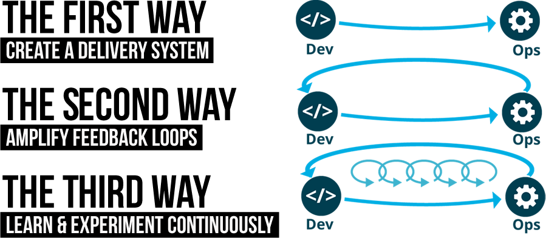
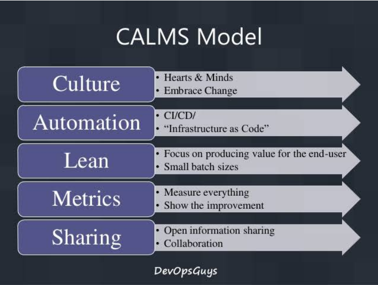

# 1) Introducción a DevOps y cultura organizativa

devops@mitocodenetwork.com
cursos@mitocodenetwork.com

[Introducción a devops](pdfs/mitocode-java-devops-01.pdf)

1:21 ¿Qué es DevOps?

Forma de trabajo que rompe el muro de confusión entre el área de desarrollo (programadores, qa) y operaciones, de forma que el desarrollo de software llegue de una forma fácil y sencilla al grupo de operaciones.
Dejar atrás los silos y trabajar en equipo. Se trata principalmente de una cultura.

17:05 ¿Porque DevOps?

Consolida, posiciona mejor a las organizaciones en el mercado.
DevOps es un cambio de pensamiento (mindset), nuevas herramientas  y nuevas habilidades.

22:40 Cultura organizativa.

Propio de personas y grupos de personas, forma de trabajar.
Procesos y prácticas: Ejemplo: proceso de desarrollo, usar herramientas digitales.
Herramientas y tecnologías: Ejemplo: Stack Java, IDE Spring Tool Suite.

35:30 Cultura organizativa: Trinidad DevOps

Manifiesto Ágil: Forma una cultura ágil propia basada en los principios ágiles. Puede basarse en frameworks: Scrum, Kanban.

https://agilemanifesto.org/iso/es/manifesto.html

41:00 Los 3 caminos.
Se centrará en el curso en el primer camino (The First Way).
LLevar el desarrollo a operaciones creando un sistema de entregas.
Se creará un sistema de entrega usando java.

50:52 Agile
Cultura Agile nos permite romper la brecha entre negocio y el equipo de desarrollo.
Manifiesto agile: Los 12 principios.

1:00:00 Agile: Cómo llevarlo a la práctica
Scrum: Basado en Sprint Backlog.
Kanban: Basado en Product Backlog. Mas light que Scrum, tiene menos prescripciones.

1:11:00 DevOps se basa en cultura, generalmente está basada en la cultura ágil. Esa cultura impulsa la automatización, la medición. Una cultura de compartir y trabajar en equipo.

Sharing: Significa compartir la información, no romper las responsabilidades.

1:15:00 
DevOps Practitioner: Da recomendación y ajustes de como Dev, QA, Ops funcionan, vigilan todo el proceso. Se Acompaña del Scrum Master en caso de la metodología ágil.

DevOps Engineer/ SysOps 2.0: Ingeniero responsable primeramente del pipeline  DevOps. Intervienen herramientas como sonarqube, jenkins, jira, etc. Gestionar y mantener el pipeline es su responsabilidad.

1:30:00
Niveles de maduración en la implementación de The First Way.
Inception: Determinar la cultura de la organización, con prácticas ágiles.
Continuous Integration: Pasar el source code por un proceso de calidad que asegure un artefacto de calidad.
    Java SE -> JAR
Continuous Delivery: Entrega de valor continua y automatizada hasta obtener un artefacto probado y certificado con nuevas funcionalidades.
Continuous Deployment: Desplegar este software automáticamente sin intervención humana. 
